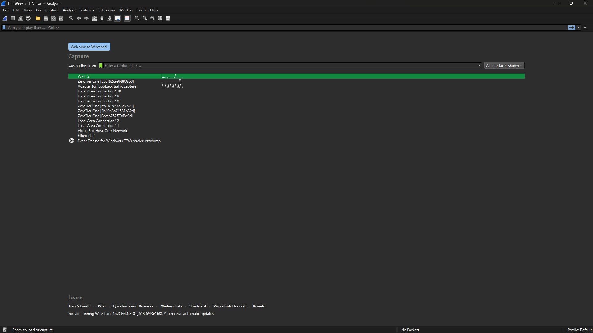
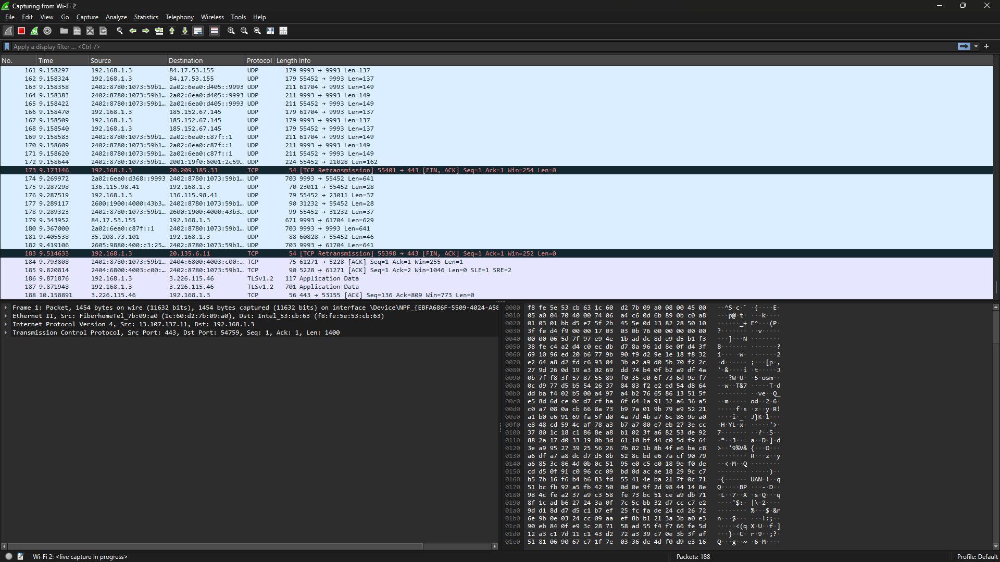
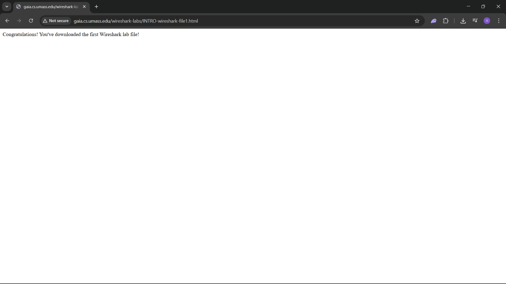
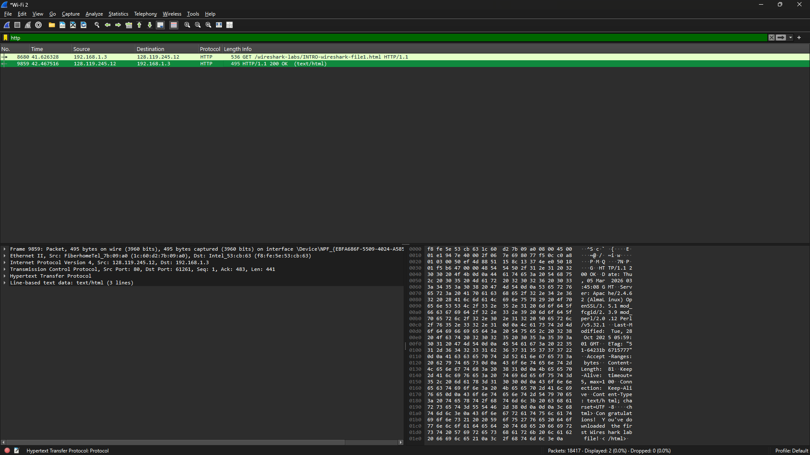
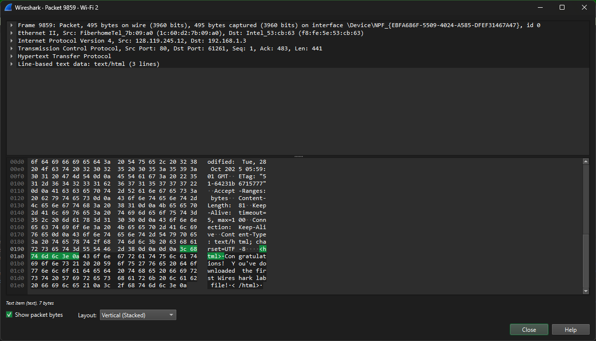
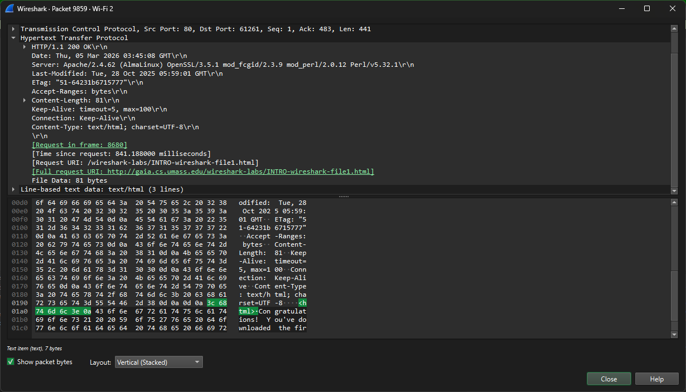

# Laporan Praktikum Jarkom IF

## Tujuan Praktikum
Mempelajari Wireshark

## Langkah Percobaan
1. Menjalankan Wireshark
Membuka wireshark kemudian tekan 2 kali pada wifi

Kemudian akan muncul log semua paket yang di kirim atau di terima dari wifi

2. Membuka Website HTTP
Pada praktikum kali ini kita akan menggunakan website http berikut:
http://gaia.cs.umass.edu/wiresharklabs/INTRO-wireshark-file1.html
Berikut adalah tampilan website http:

Dikarenakan website tersebut merupakan http maka proses kirim dan terima yang
terjadi pada website itu dapat dilihat, untuk melihat proses pada website tersebut maka
cukup di filter dengan mengetikan “http” pada filter, berikut adalah proses yang dapat
dilihat:

Terlihat terdapat pesan http get yang dikirim dari komputer saya ke server http website
tersebut dan terdapat pesan http/1.1 200 ok, bertikut isi dari proses yang dilakukan
pada http/1.1 200 ok

