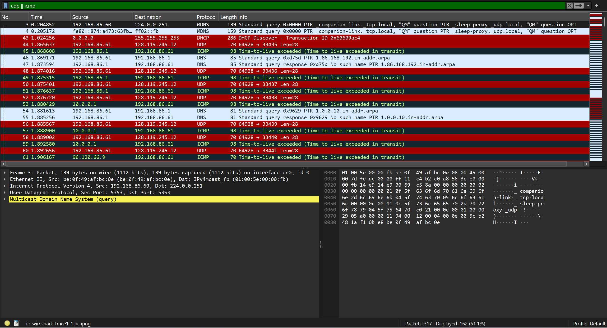
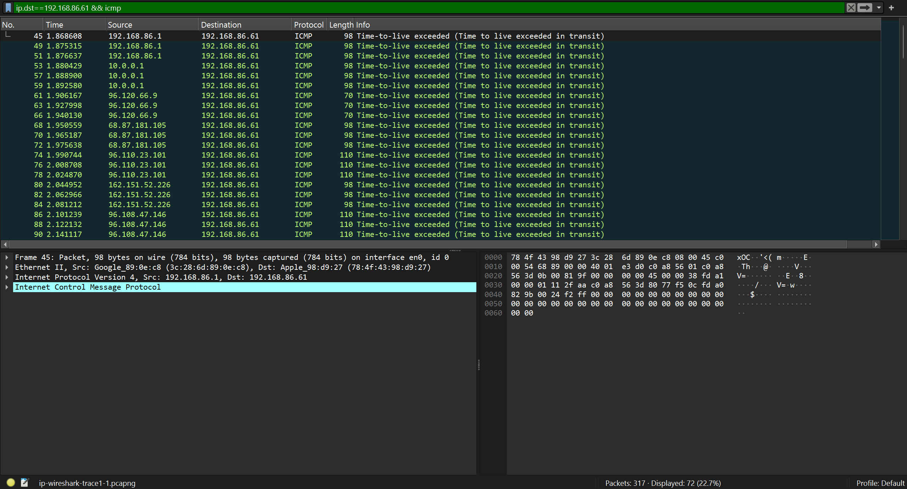
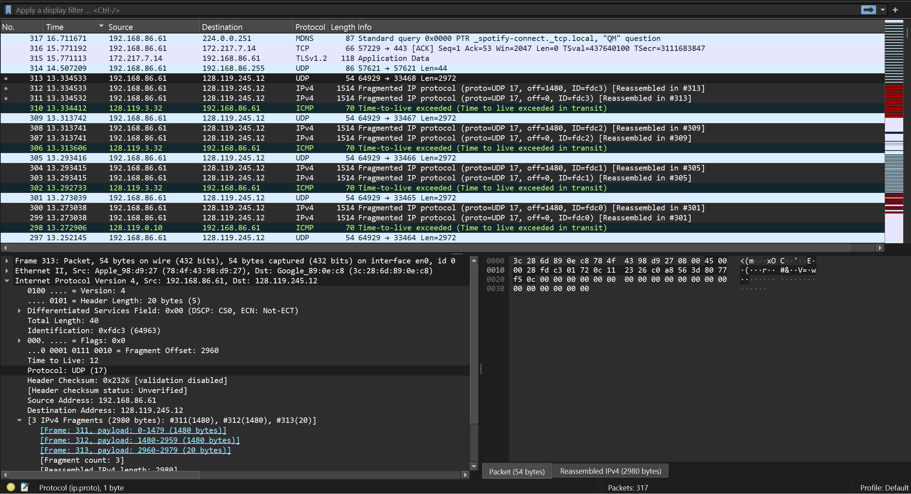

# Laporan Praktikum Jaringan Komputer
## Modul 10 – Analisis Datagram IPv4, Fragmentasi, dan IPv6 dengan Wireshark

---

## Bagian 1 – IPv4 Dasar
1. Jalankan traceroute ke `gaia.cs.umass.edu` dengan ukuran 56 byte.  
2. ketik filter Wireshark:  
   - `udp || icmp`  
   - `ip.src==192.168.86.61 && ip.dst==128.119.245.12 && udp && !icmp`  
   - `ip.dst==192.168.86.61 && icmp`  

Kemudian akan menghasilkan
- Paket UDP dikirim ke tujuan.  
- Router perantara mengembalikan ICMP TTL-exceeded.  

---

## Bagian 2 – Fragmentasi
1. Jalankan traceroute dengan ukuran 3000 byte.  
2. Hilangkan filter, urutkan paket berdasarkan kolom Time.  
3. Amati paket UDP besar (Len ≈ 2972).  
4. Perhatikan fragmen IPv4 dengan Identification sama, Offset berbeda, dan MF flag.

Kemudian akan menghasilkan
- Paket UDP besar (2972 byte) terfragmentasi.  
- Fragmen pertama: Offset = 0, MF = 1.  
- Fragmen kedua: Offset = 1480, MF = 0.  
- Semua fragmen punya Identification sama.  

**Screenshot:**  

---

## Bagian 3 – IPv6
1. Buka file `ip-wireshark-trace2-1.pcapng`.  
2. Gunakan filter: `frame.number < 300`.  
3. Amati paket ke-20 (t=3.814489).  

Kemudian akan menghasilkan 
- Paket ke-20 adalah DNS AAAA request untuk `youtube.com`.  
- Header IPv6 menampilkan Traffic Class, Flow Label, Payload Length, Next Header, Hop Limit.  
- Alamat sumber dan tujuan berupa IPv6.  

**Screenshot:**  
