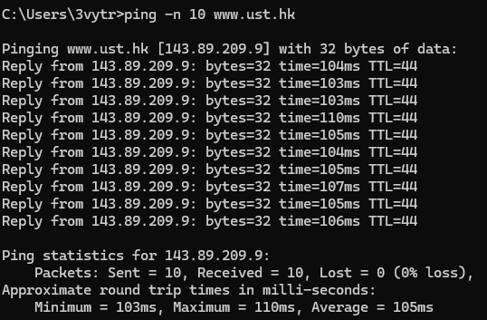
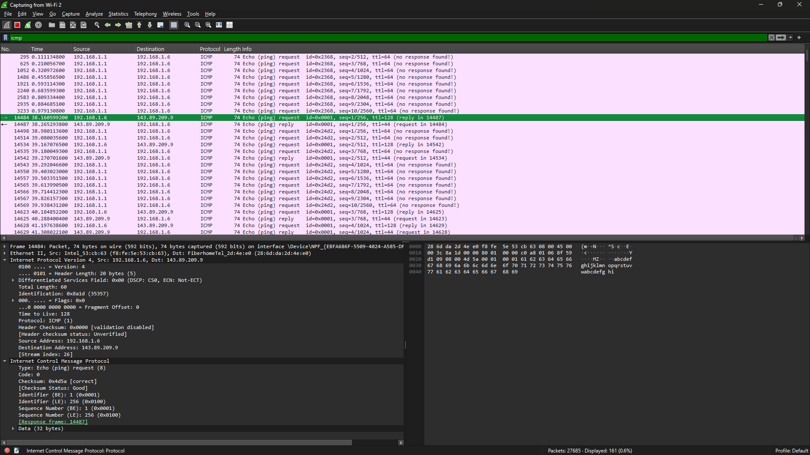
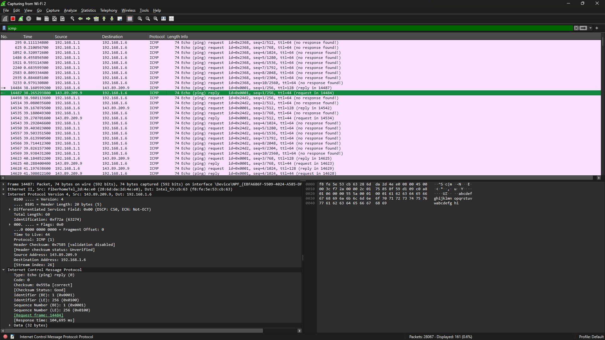
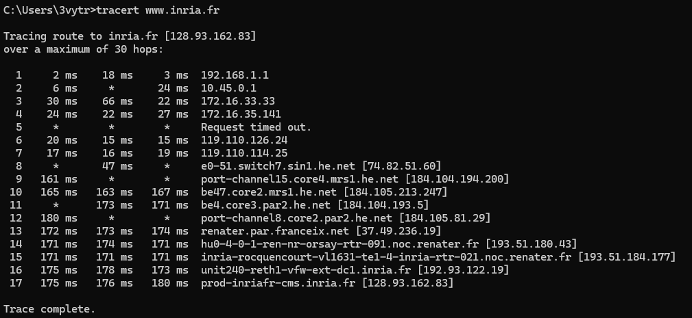
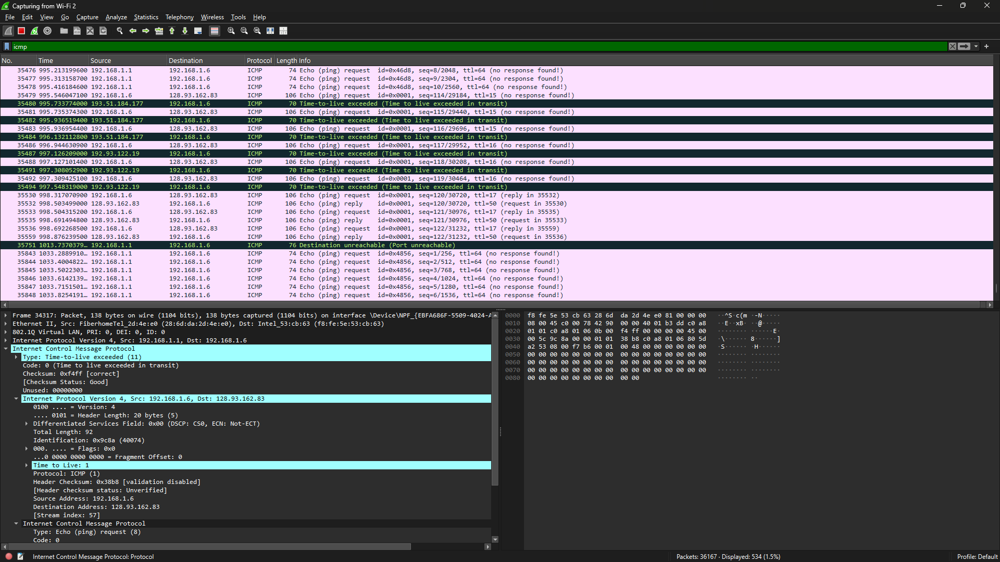

README PRAKTIKUM WIRESHARK ICMP

Nama Praktikum:
Pengamatan Protokol ICMP Menggunakan Wireshark

Tujuan:
1. Mengetahui mekanisme kerja protokol ICMP.
2. Mengamati paket ICMP yang muncul saat menjalankan perintah Ping.
3. Mengamati paket ICMP yang muncul saat menjalankan perintah Traceroute.
4. Memanfaatkan Wireshark sebagai alat penangkap dan pembaca paket jaringan.

Alat yang Digunakan:
1. Wireshark
2. Command Prompt Windows
3. Akses Internet

=================================================================

TAHAPAN PRAKTIKUM PING

1. Buka aplikasi Wireshark.
2. Tentukan interface jaringan yang sedang aktif digunakan.
3. Tekan tombol Start Capture.
4. Buka jendela Command Prompt.
5. Ketikkan perintah berikut:

ping -n 10 www.ust.hk

6. Tunggu hingga proses ping selesai berjalan.
7. Hentikan capture pada Wireshark.
8. Terapkan filter berikut:

icmp

=================================================================

DAFTAR SCREENSHOT YANG DIPERLUKAN

1. Output Perintah Ping pada Command Prompt

Penjelasan:
Gambar ini memperlihatkan output dari eksekusi perintah `ping -n 10 www.ust.hk`, yang menampilkan ringkasan statistik proses ping menuju server www.ust.hk beralamat IP 143.89.209.9. Adapun hasilnya sebagai berikut:
- Jumlah paket terkirim: 10 paket dengan ukuran masing-masing 32 byte
- Jumlah paket diterima kembali: 10 paket (tidak ada paket yang hilang/0% packet loss)
- Waktu tempuh pulang-pergi (RTT): terendah 60ms, tertinggi 67ms, rata-rata 62ms
- Pada setiap balasan tercantum ukuran byte, waktu respons, dan nilai TTL (43)

Data ini menjadi bukti bahwa server tujuan dalam kondisi aktif dan mampu memberikan respons dengan baik.

-------------------------------------------------------------

2. Rincian Paket ICMP Echo Request pada Wireshark

Penjelasan:
Gambar berikut memperlihatkan rincian paket ICMP Echo Request (permintaan ping) yang berhasil ditangkap oleh Wireshark. Beberapa data penting yang tampak:
- Type: Echo (ping) request = 8
- Code: 0
- Source Address: 192.168.1.6
- Destination Address: 143.89.209
- Identifier (BE): 1 (0x0001)
- Sequence Number: 1 (0x0001)
- Ukuran total paket: 74 byte

Paket ini dikirimkan oleh host lokal sebagai upaya untuk memeriksa apakah host tujuan dapat dijangkau. Nilai TTL (Time to Live) diatur sebesar 128 agar paket dapat melewati sejumlah hop router sebelum sampai ke tujuan.

-------------------------------------------------------------

3. Rincian Paket ICMP Echo Reply pada Wireshark

Penjelasan:
Gambar ini menampilkan rincian paket ICMP Echo Reply (balasan ping) yang dikirim balik oleh host tujuan. Data penting yang terlihat:
- Type: Echo (ping) reply = 0
- Code: 0
- Source Address: 143.89.209.9 (berasal dari host yang di-ping)
- Destination Address: 192.168.1.6 (kembali menuju host pengirim awal)
- Identifier (BE): 1 (0x0001) - identik dengan request
- Sequence Number: 1 (0x0001) - identik dengan request
- Waktu Respons: 104,695 ms
- Ukuran total paket: 74 byte

Paket balasan ini memiliki struktur yang serupa dengan paket request, hanya saja nilai Type-nya adalah 0 sebagai penanda bahwa paket tersebut merupakan reply. Kesamaan sequence number pada request dan reply memungkinkan keduanya untuk saling dicocokkan.

=================================================================

TAHAPAN PRAKTIKUM TRACEROUTE

1. Buka kembali aplikasi Wireshark.
2. Aktifkan proses capture.
3. Buka Command Prompt.
4. Ketikkan perintah berikut:

tracert www.inria.fr

5. Tunggu hingga proses selesai berjalan.
6. Hentikan capture pada Wireshark.
7. Terapkan filter berikut:

icmp

=================================================================

DAFTAR SCREENSHOT TRACEROUTE

5. Output Perintah Tracert pada Command Prompt

Penjelasan:
Gambar berikut memperlihatkan output dari eksekusi perintah `tracert www.inria.fr`, yang menampilkan rute yang ditempuh paket dari host lokal hingga mencapai server inria.fr dengan alamat IP 128.93.162.83. Hasil yang ditampilkan mencakup:
- Sebanyak 17 hop dilalui paket sebelum sampai ke tujuan
- Setiap baris menampilkan:
  - Urutan nomor hop
  - Nama host atau alamat IP dari router/hop yang dilewati

Pada hop pertama (1) terlihat gateway lokal (gpon.net dengan IP 192.168.1.1) dengan RTT sebesar 2 ms, 18 ms, dan 3 ms. Sejumlah hop menampilkan tanda * yang mengindikasikan terjadinya timeout (router tidak memberikan respons). Hop terakhir (17) merupakan server tujuan, yaitu prod-inriafr-cms.inria.fr dengan IP 128.93.162.83, dengan RTT yang relatif stabil di kisaran 175ms.

-------------------------------------------------------------

6. Rincian Paket ICMP Time-to-Live Exceeded pada Wireshark

Penjelasan:
Gambar ini menampilkan rincian paket ICMP Time-to-live exceeded yang dikirimkan oleh router perantara di sepanjang proses traceroute. Data penting yang tercantum:
- Type: Time-to-live exceeded = 11
- Code: 0 (Time to live exceeded in transit)
- Source Address: 192.168.1.5 (berasal dari router pengirim pesan)
- Destination Address: 128.93.162.83 (ditujukan kembali ke host pengirim)
- Pesan menandakan bahwa nilai TTL telah mencapai 0 sehingga paket terpaksa dibuang (drop)
- Field Time to Live menunjukkan angka 1 pada saat paket diterima oleh router

Mekanisme inilah yang menjadi dasar cara kerja traceroute. Traceroute mengirimkan rangkaian paket dengan nilai TTL yang terus bertambah (1, 2, 3, dan seterusnya) sehingga memicu munculnya balasan Time-Exceeded dari tiap-tiap hop yang dilewati menuju tujuan akhir. Dengan mengamati source IP dari balasan-balasan tersebut, traceroute dapat menyusun rute lengkap menuju host tujuan.

=================================================================

KESIMPULAN

1. ICMP berfungsi sebagai sarana komunikasi kontrol dan diagnosis pada jaringan.
2. Mekanisme ping memanfaatkan ICMP Echo Request dan Echo Reply.
3. Traceroute memanfaatkan mekanisme TTL untuk menelusuri jalur yang dilalui paket.
4. Wireshark dapat dimanfaatkan untuk mengamati paket ICMP secara mendetail.