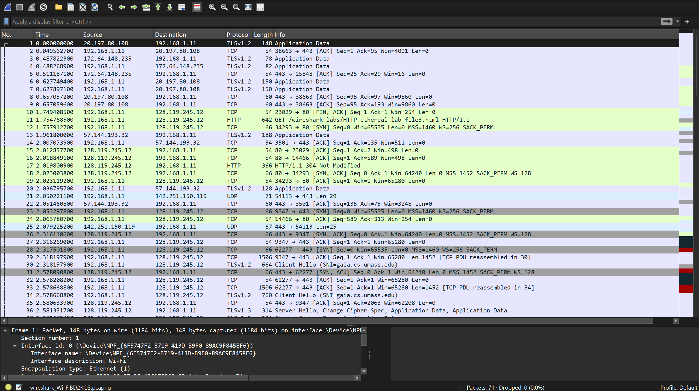
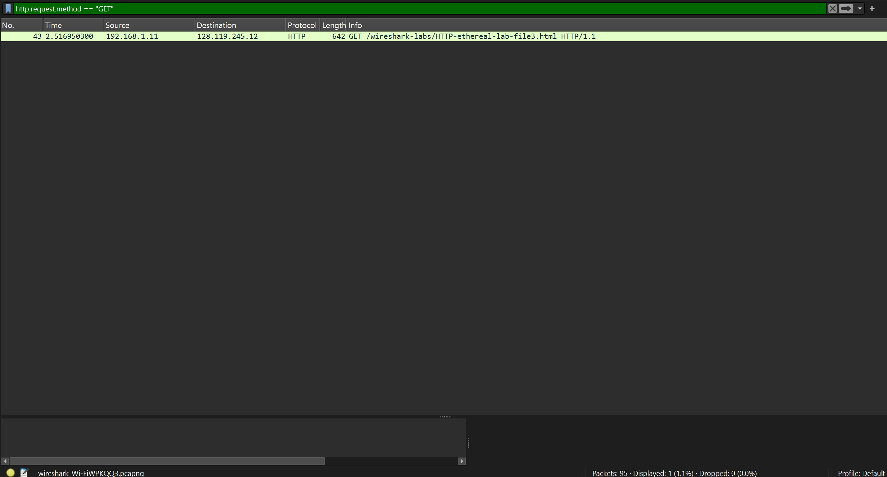
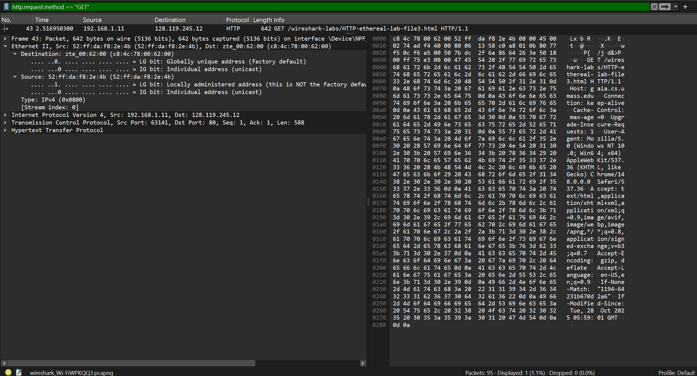
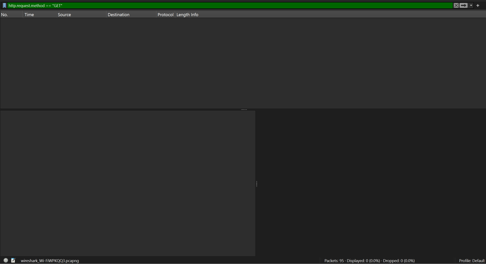
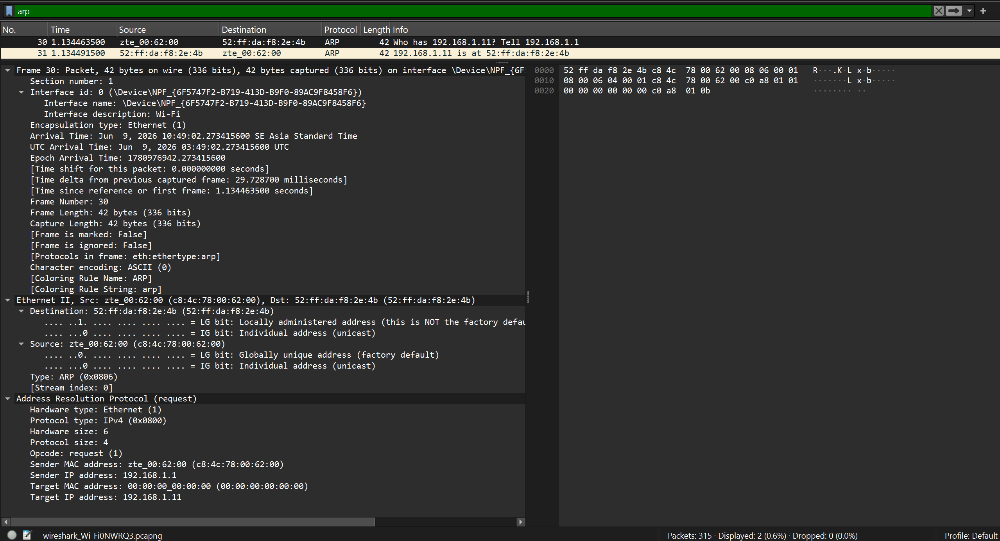
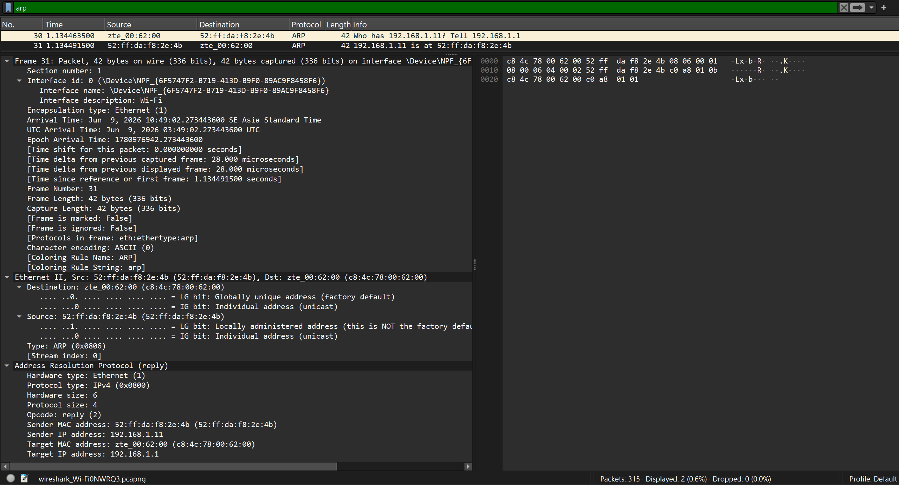

# Modul 13 – Pengamatan Ethernet dan ARP (Wireshark)

## 1. Tujuan Praktikum
Mahasiswa mampu menelusuri cara kerja protokol Ethernet dan ARP dengan memanfaatkan aplikasi Wireshark.

---

## 2. Pengamatan Ethernet Frame

Pada bagian ini, proses capture paket dilakukan ketika mengakses sebuah halaman web melalui Wireshark. Maksudnya adalah untuk mengamati frame Ethernet yang membawa data HTTP, khususnya pada saat terjadi HTTP GET request.

### 2.1 Proses Capture Traffic di Wireshark

Wireshark diaktifkan lebih dahulu sebelum mengakses alamat berikut:

http://gaia.cs.umass.edu/wireshark-labs/HTTP-wireshark-lab-file3.html

Tampilan hasil capture awal:



---

### 2.2 Paket HTTP GET Request

Setelah halaman web berhasil diakses, ditemukan adanya paket HTTP GET yang terkirim dari komputer pengguna menuju server.

Paket HTTP GET:



---

### 2.3 Rincian Ethernet Frame

Paket HTTP GET tersebut selanjutnya diperiksa pada lapisan (layer) Ethernet untuk mengetahui informasi MAC address, baik sumber maupun tujuan.

Rincian Ethernet frame:



---

### 2.4 Penyaringan Protokol Selain IP

Agar pengamatan dapat berfokus pada Ethernet dan ARP, protokol IP dimatikan melalui menu *Analyze → Enabled Protocols*.

Tampilan setelah protokol IP dinonaktifkan:



---

## 3. Pengamatan ARP (Address Resolution Protocol)

ARP berperan dalam memetakan hubungan antara IP address dengan MAC address pada jaringan lokal.

---

### 3.1 Penghapusan Cache ARP

Sebelum pengamatan ARP dilaksanakan, cache ARP terlebih dahulu dikosongkan supaya proses request dapat teramati secara langsung di Wireshark.

Perintah yang digunakan:
```
arp -d *
```

Tampilan cache ARP setelah dikosongkan:


---

### 3.2 ARP Request

ARP Request merupakan paket yang dikirim secara broadcast, digunakan untuk menelusuri MAC address dari suatu IP tertentu.

Pada hasil capture, ditemukan paket berikut:

> Who has 192.168.1.11? Tell 192.168.1.1

Pesan ini menandakan bahwa suatu perangkat sedang mencari tahu MAC address dari IP 192.168.1.11.

ARP Request (broadcast):



---

### 3.3 ARP Reply

ARP Reply merupakan tanggapan dari perangkat pemilik IP yang dicari, berisikan MAC address yang sesuai dengan IP tersebut.

Pada capture, terlihat:

> 192.168.1.11 is at 52:ff:da:f8:26:4b

Artinya, perangkat dengan IP tersebut mengirimkan kembali alamat MAC miliknya.

ARP Reply:



---

## 4. Kesimpulan

- Ethernet berperan dalam komunikasi data pada lapisan data link dengan menggunakan MAC address.
- ARP berfungsi untuk menerjemahkan IP address ke dalam bentuk MAC address.
- ARP Request dipakai untuk menanyakan pihak yang memiliki IP tertentu.
- ARP Reply dipakai untuk memberikan jawaban berupa MAC address yang diminta.
- Wireshark memungkinkan pengamatan rinci terhadap komunikasi jaringan hingga ke lapisan Ethernet dan ARP.
