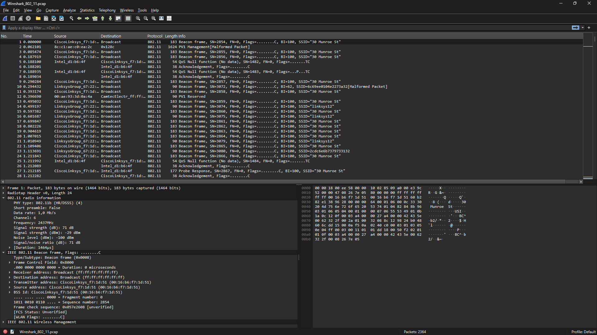

# Modul 14 – 802.11 WiFi (Wireshark)

## 1. Tujuan Praktikum
Mahasiswa dapat menginvestigasi dan memahami cara kerja protokol jaringan nirkabel IEEE 802.11 (WiFi) menggunakan aplikasi Wireshark.

---

## 2. Analisis 802.11 WiFi Frame

Pada bagian ini dilakukan analisis paket dari berkas trace Wireshark yang telah disediakan untuk mengamati struktur frame nirkabel 802.11, termasuk Beacon frames dan Data frames.

### 2.1 Unduh Berkas Trace Wireshark

Berkas zip yang berisi trace Wireshark diunduh melalui tautan berikut:
http://gaia.cs.umass.edu/wireshark-labs/wireshark-traces.zip

Berkas spesifik yang dianalisis adalah `Wireshark_802_11.pcap`.

Hasil pemuatan berkas awal di Wireshark:

---

### 2.2 Beacon Frames (Frame Suar)

Beacon frame digunakan oleh Access Point (AP) untuk mengumumkan keberadaannya kepada perangkat di sekitarnya secara periodik.

Detail sub-bidang IEEE 802.11 Wireless LAN pada Beacon Frame:

---

### 2.3 HTTP GET Request & Transfer Data

Pengamatan dilakukan pada pemindahan data nirkabel ketika host melakukan request HTTP.

- Pada $t = 24.82$, host mengirimkan HTTP GET request ke alamat IP `128.119.245.12`.
- Pada $t = 32.82$, host mengirimkan HTTP GET request ke `www.cs.umass.edu`.

Detail paket transfer data:

---

### 2.4 Analisis Kaitan (Association / Disassociation)

Proses manajemen koneksi nirkabel dianalisis melalui frame Association Request (type 0, subtype 0) dan Association Response (type 0, subtype 1).

Tampilan frame asosiasi:

---

## 3. Kesimpulan

- Protokol 802.11 (WiFi) bekerja pada lapisan fisik dan data link menggunakan mekanisme frame nirkabel khusus.
- Beacon Frame berfungsi untuk mengiklankan keberadaan jaringan nirkabel oleh Access Point.
- Proses asosiasi (Association) diperlukan sebelum perangkat dapat mengirimkan data seperti paket HTTP di jaringan Wi-Fi.
- Wireshark mempermudah pengamatan sub-lapangan IEEE 802.11 seperti frame control, durasi, alamat MAC, dan parameter nirkabel lainnya.
