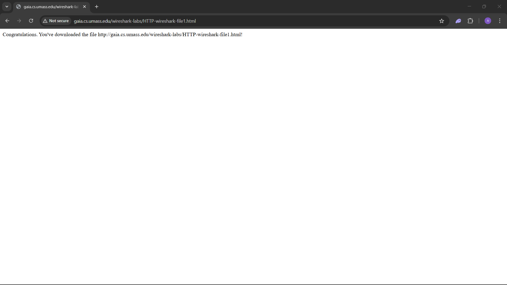
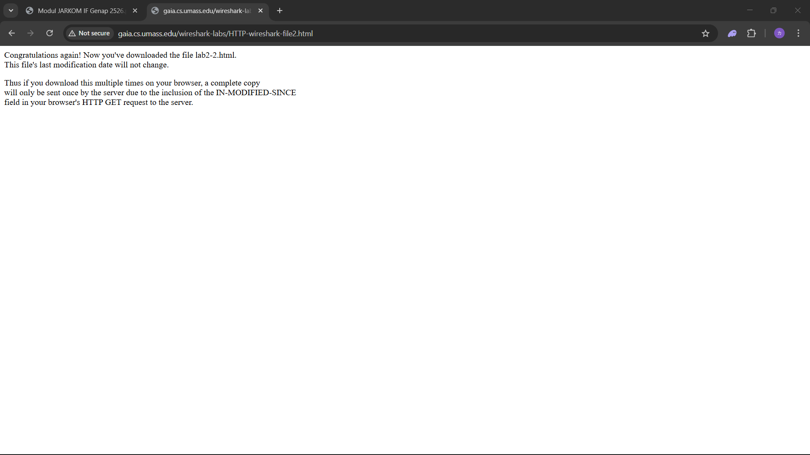
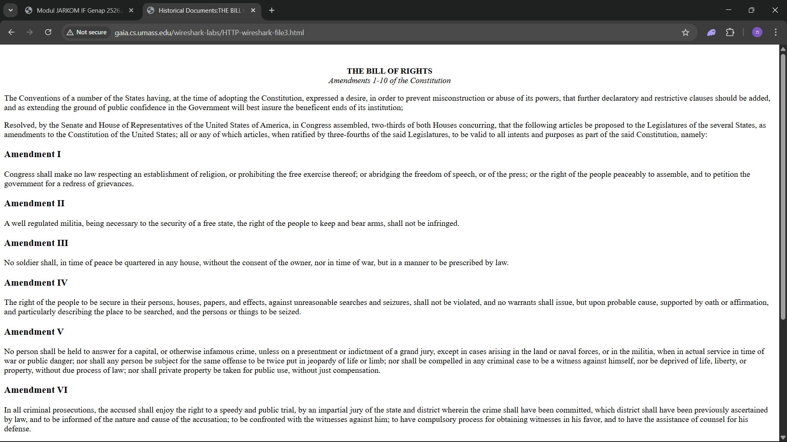
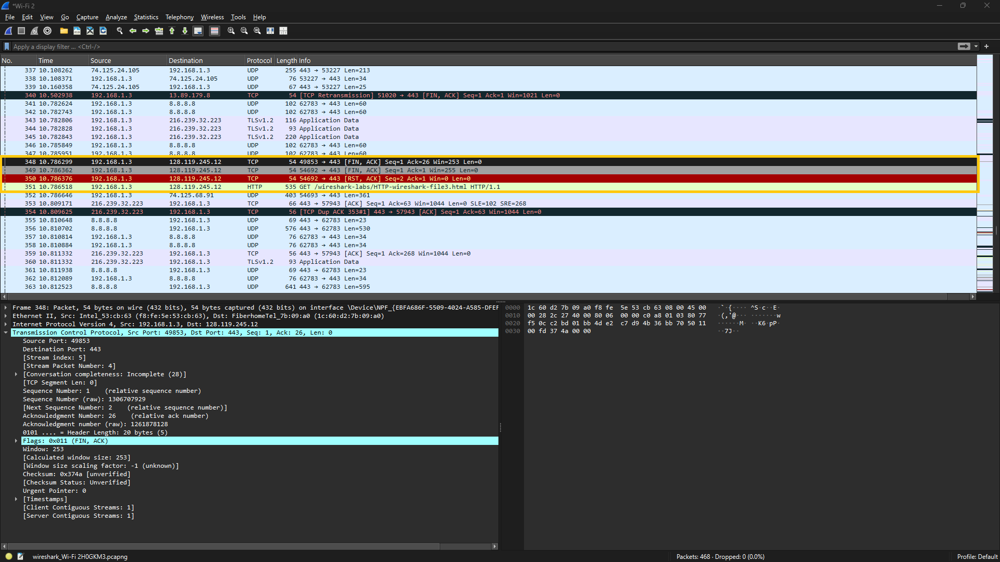
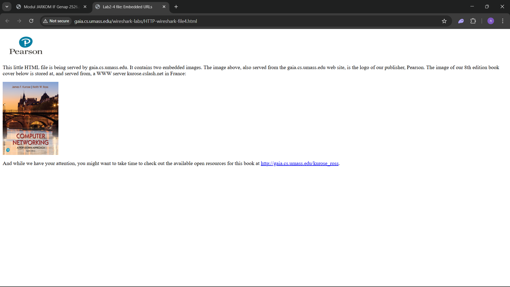
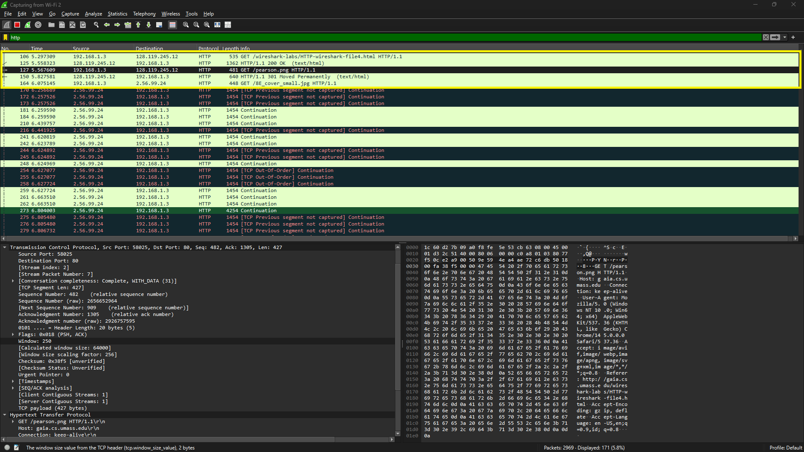
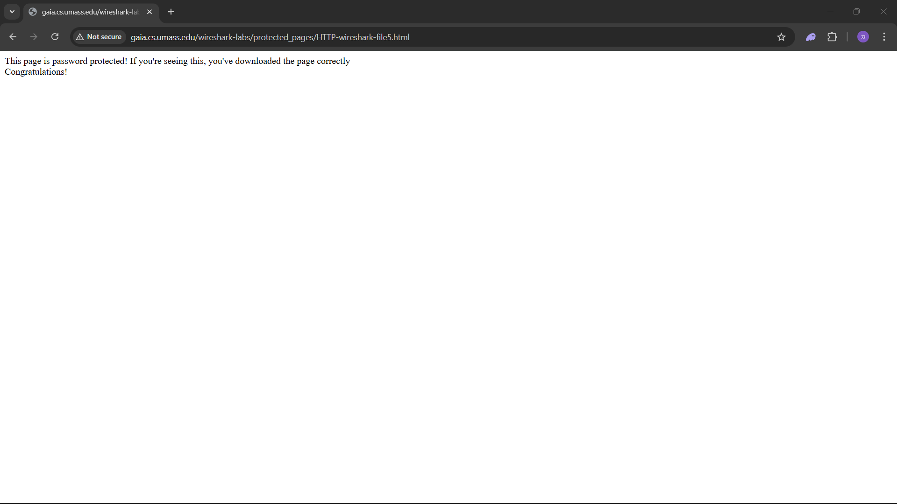
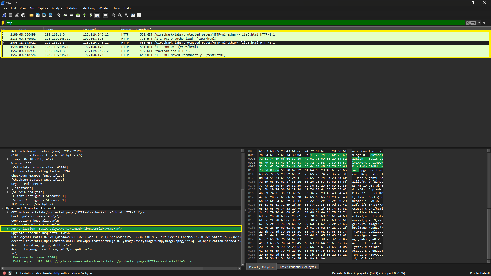

# Laporan Praktikum Jarkom IF

## Tujuan Praktikum
Mempelajari protokol yang sedang berjalan

## Langkah Percobaan
1. Basic HTTP GET response interaction
- Membuka browser
- Menghapus cache browser
- Membuka link: http://gaia.cs.umass.edu/wireshark-labs/HTTPwireshark-file1.html

- Dapat dilihat pada log wireshark ada proses get dan terdapat pesan "ok" menunjukkan telah berhasil membuka website
1

2. HTTP CONDITIONAL GET/response interaction
- Membuka browser
- Membuka link: http://gaia.cs.umass.edu/wireshark-labs/HTTPwireshark-file2.html

- Dapat dilihat pada log wireshark ada proses get dan terdapat pesan "not modified" menunjukkan browser masih menyimpan cache sehingga tidak perlu ada yang dikirim ke client
1

3. Retrieving Long Documents
- Membuka browser
- Menghapus cache browser
- Membuka link: http://gaia.cs.umass.edu/wireshark-labs/HTTPwireshark-file3.html

- Dapat dilihat pada log wireshark ada beberapa protocol tcp, hal itu terjadi ketika data yang dikirim ke client memiliki ukuran melebihi 4500 byte sehingga butuh untuk dipecah ketika dikirim

4. HTML Documents dengan embedded Objects
- Membuka browser
- Menghapus cache browser
- Membuka link: http://gaia.cs.umass.edu/wireshark-labs/HTTPwireshark-file4.html

- Dapat dilihat pada log wireshark ada proses get yang berisikan png, hal itu terjadi ketika website mengirimkan image kepada client

5. HTTP Authentication
- Membuka browser
- Menghapus cache browser
- Membuka link: http://gaia.cs.umass.edu/wiresharklabs/protected_pages/HTTP-wireshark-file5.html

- Dapat dilihat pada bagian authorization terdapat string acak, hal itu terjadi ketika client melakukan login pada wibsite http, string acak itu merukan username dan password dari client, walaupun terlihat telah terenkrpisi tetapi sebenarnya string itu adalah sebuah format Base64
