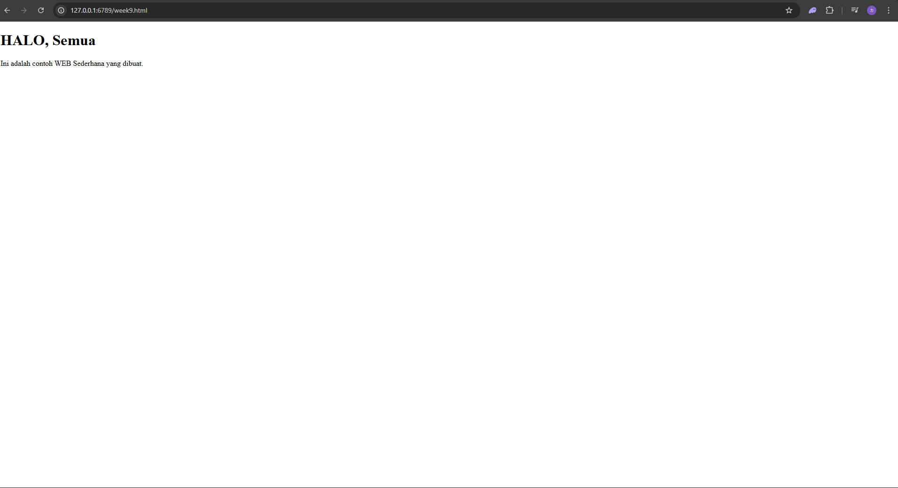

# Web Server

## Code web server

```python
#import socket module
from socket import *
import sys # In order to terminate the program
serverSocket = socket(AF_INET, SOCK_STREAM)

#Prepare a sever socket
#Fill in start
serverPort = 6789
serverSocket.bind(('127.0.0.1', serverPort))
serverSocket.listen(1)
#Fill in end
while True:
    #Establish the connection
    print('Ready to serve...')
    connectionSocket, addr = serverSocket.accept()
    try:
        message = connectionSocket.recv(1024).decode()
        filename = message.split()[1]
        f = open(filename[1:])
        outputdata = f.read()
        #Send one HTTP header line into socket
        #Fill in start
        connectionSocket.send("HTTP/1.1 200 OK\r\n".encode())
        connectionSocket.send("Content-Type: text/html\r\n".encode())
        connectionSocket.send("\r\n".encode())
        #Fill in end
        #Send the content of the requested file to the client
        for i in range(0, len(outputdata)):
            connectionSocket.send(outputdata[i].encode())
        connectionSocket.send("\r\n".encode())
        connectionSocket.close()
    except IOError:
    #Send response message forfile not found
    #Fill in start
        connectionSocket.send("HTTP/1.1 404 not found\r\n". encode())
        connectionSocket.send("<html><body><h1> 404 not found <h1><body><html>". encode())

    #Fill in end
    #Close client socket
    #Fill in start
        connectionSocket.close()
    #Fill in end
serverSocket.close()
sys.exit()#Terminate the program after sending the corresponding
data
```

## code html

```html
<!DOCTYPE html>
<html lang="en">
<head>
    <meta charset="UTF-8">
    <meta name="viewport" content="width=device-width, initial-scale=1.0">
    <title>Tugas Week 9</title>
</head>
<body>
    <h1>HALO, Semua</h1>
    <p>Ini adalah contoh WEB Sederhana yang dibuat.</p>
</body>
</html>
```

## hasil website
